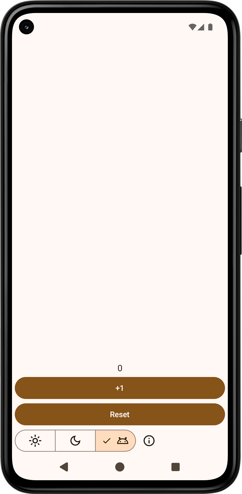

- [Jetpack Compose](https://developer.android.com/compose)
  - App
    - [counter](counter)
      - https://m3.material.io/
      - https://developer.android.com/develop/ui/compose/designsystems/material3
      - https://developer.android.com/develop/ui/compose/layouts/insets
        - https://issuetracker.google.com/issues/326356902
      - https://developer.android.com/topic/libraries/architecture/datastore
    - Plan
      - add comments
      - add documentation
        - [memo](https://github.com/manabu-nakamura/appc/wiki/memo)
      - add new apps
  - [Contributions](https://github.com/android/compose-samples/issues?q=author%3Amanabu-nakamura) 🟥
- [Material Components for Android](https://github.com/material-components/material-components-android/)
  - [App](https://github.com/manabu-nakamura/app) 🟥
  - [Contributions](https://github.com/material-components/material-components-android/issues?q=author%3Amanabu-nakamura) 🟥

https://github.com/manabu-nakamura