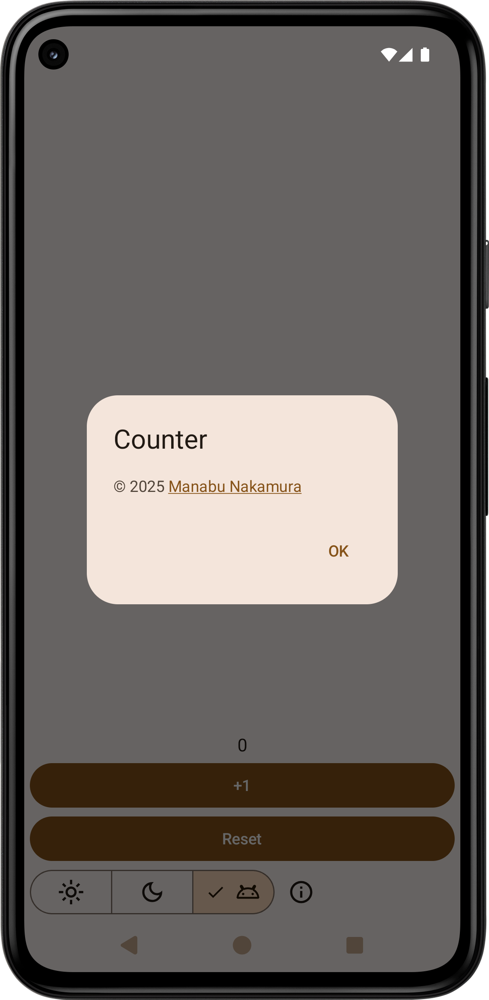
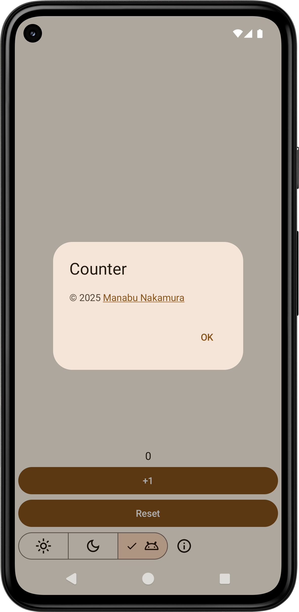

🟥https://github.com/manabu-nakamura/appc/blob/master/counter/src/main/res/values/themes.xml:
- `android:backgroundDimAmount`
```xml
<style name="Theme.App" parent="android:Theme.Material.Light.NoActionBar">
    <item name="android:backgroundDimAmount">0.32</item>
</style>
```
->\
x->`<item name="android:backgroundDimAmount">0.32</item>`\
https://github.com/material-components/material-components-android/issues/3635

[Manabu Nakamura](https://github.com/manabu-nakamura)