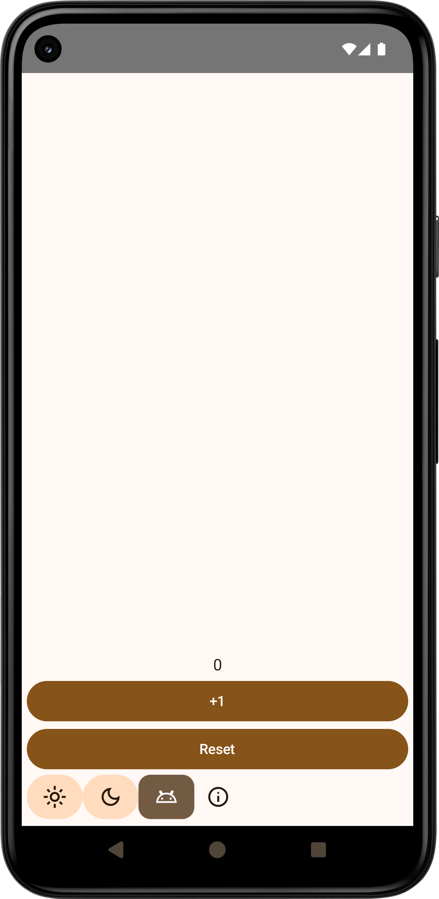
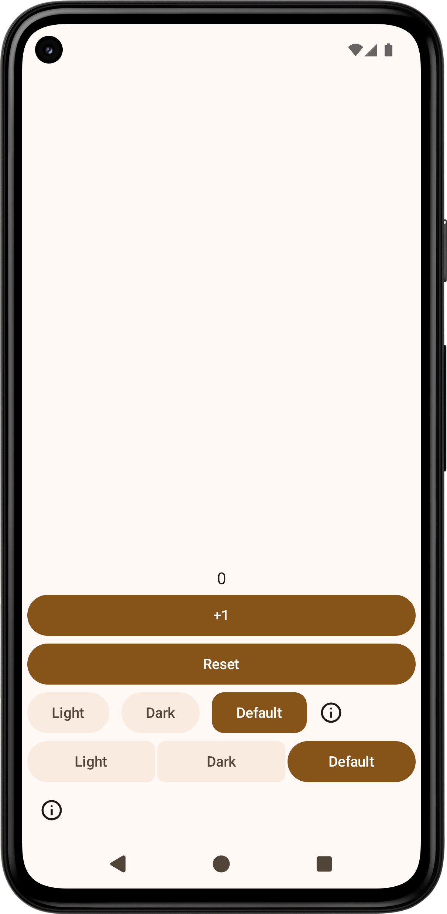
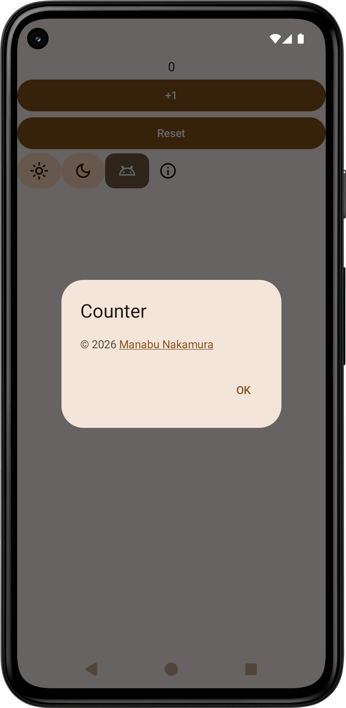
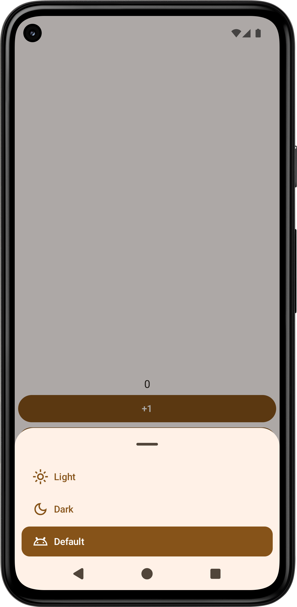
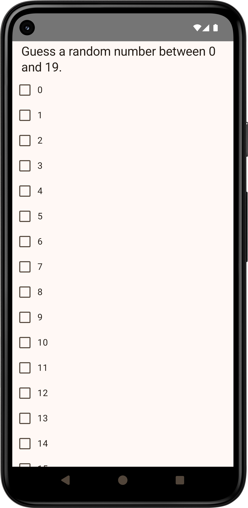
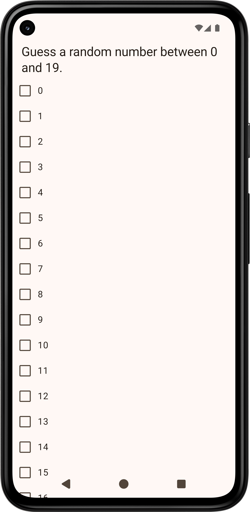

- https://m3.material.io/
  - https://m3.material.io/blog/building-with-m3-expressive
  - https://m3.material.io/blog/m3-expressive-motion-theming

> [!CAUTION]
> The app targeted Android 14 and ran on Android 15 (Android Emulator).\
> https://developer.android.com/about/versions/15/behavior-changes-15

🟥https://github.com/manabu-nakamura/appc/blob/main/counter/src/main/java/com/github/manabu_nakamura/counter/MainActivity.kt:
- edge-to-edge
```kotlin
val darkTheme = when (theme()) {
    0 -> false
    1 -> true
    else -> resources.configuration.uiMode and Configuration.UI_MODE_NIGHT_MASK == Configuration.UI_MODE_NIGHT_YES
}
val systemBarStyle = if (darkTheme) {
    SystemBarStyle.dark(
        Color.TRANSPARENT
    )
} else {
    SystemBarStyle.light(
        Color.TRANSPARENT,
        Color.TRANSPARENT
    )
}
enableEdgeToEdge(
    systemBarStyle,
    systemBarStyle
)
setContent {
    CounterTheme(
        darkTheme
    ) {
        ...
    }
}
```
->\
(0) -> (1) `enableEdgeToEdge()`\
https://issuetracker.google.com/issues/326356902

🟥https://github.com/manabu-nakamura/appc/blob/main/counter/src/main/res/values/themes.xml:
- [`android:enforceNavigationBarContrast`](https://developer.android.com/reference/android/R.attr#enforceNavigationBarContrast)
```xml
<style name="Theme.Counter" parent="android:Theme.Material.Light.NoActionBar">
    <item name="android:enforceNavigationBarContrast">false</item>
</style>
```
->\
(1) -> (2) `<item name="android:enforceNavigationBarContrast">false</item>`

- [`android:backgroundDimAmount`](https://developer.android.com/reference/android/R.attr#backgroundDimAmount)
```xml
<style name="Theme.Counter" parent="android:Theme.Material.Light.NoActionBar">
    <item name="android:backgroundDimAmount">0.32</item>
</style>
```
->\
(1) -> (3) `<item name="android:backgroundDimAmount">0.32</item>`\
https://github.com/material-components/material-components-android/issues/3635

🟥https://github.com/manabu-nakamura/appc/blob/main/game/src/main/java/com/github/manabu_nakamura/game/MainActivity.kt:
- edge-to-edge
```kotlin
enableEdgeToEdge()
if (Build.VERSION.SDK_INT >= Build.VERSION_CODES.Q) {
    window.isNavigationBarContrastEnforced = false
}
setContent {
    GameTheme {
        ...
    }
}
```
->\
(0) -> (1) `enableEdgeToEdge()`\
https://issuetracker.google.com/issues/326356902

[Manabu Nakamura](https://github.com/manabu-nakamura)